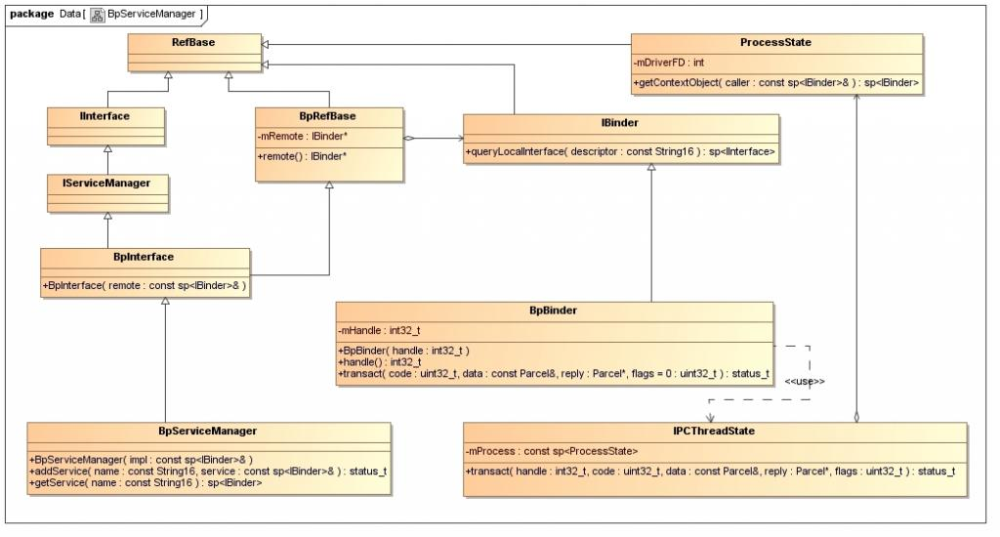
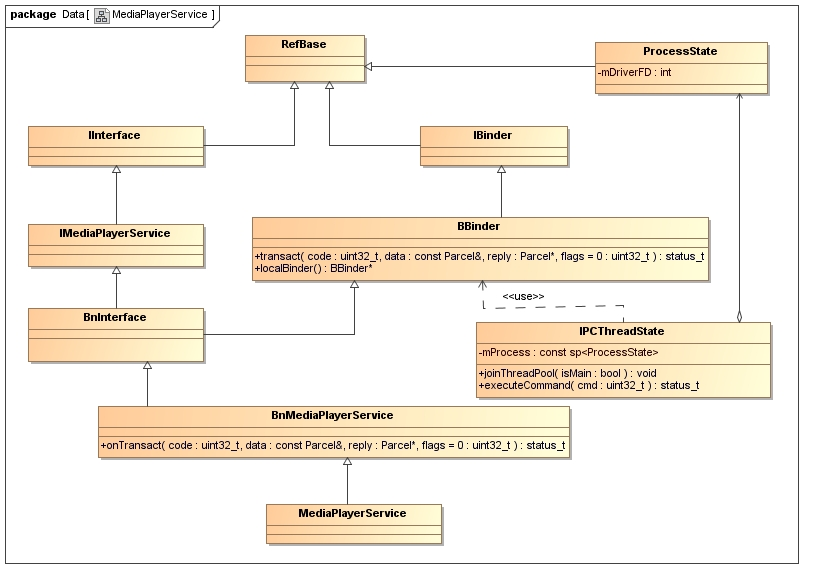
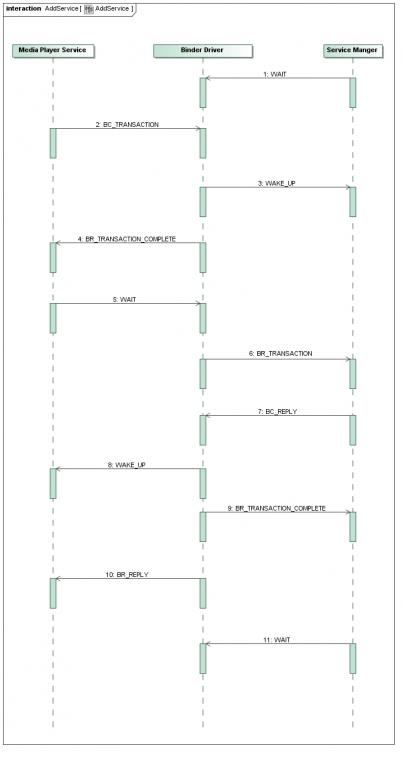
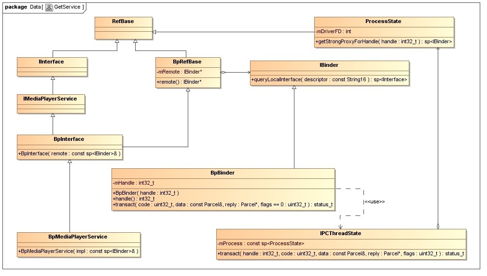
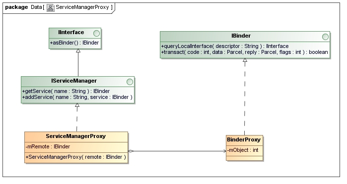
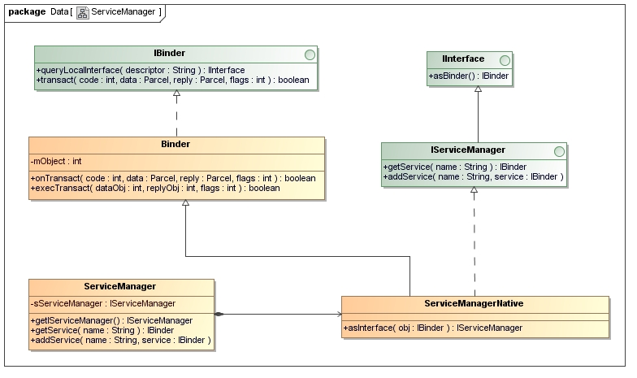

> 参考资料地址
> [Android进程间通信（IPC）机制Binder简要介绍和学习计划](https://blog.csdn.net/Luoshengyang/article/details/6618363?ops_request_misc=%257B%2522request%255Fid%2522%253A%2522160152745619195188343406%2522%252C%2522scm%2522%253A%252220140713.130102334.pc%255Fblog.%2522%257D&request_id=160152745619195188343406&biz_id=0&utm_medium=distribute.pc_search_result.none-task-blog-2~blog~first_rank_v2~rank_blog_v1-1-6618363.pc_v2_rank_blog_v1&utm_term=Binder&spm=1018.2118.3001.4187)

Android系统Binder机制中的四个组件Client、Server、Service Manager和Binder驱动程序的关系如下图所示：

1. Client、Server和Service Manager实现在用户空间中，Binder驱动程序实现在内核空间中

2. Binder驱动程序和Service Manager在Android平台中已经实现，开发者只需要在用户空间实现自己的Client和Server

3. Binder驱动程序提供设备文件/dev/binder与用户空间交互，Client、Server和Service Manager通过open和ioctl文件操作函数与Binder驱动程序进行通信

4. Client和Server之间的进程间通信通过Binder驱动程序间接实现

5. Service Manager是一个守护进程，用来管理Server，并向Client提供查询Server接口的能力
----
Service Manager 成为 Android 进程间通信机制 Binder 守护进程
1. 打开/dev/binder文件：open("/dev/binder", O_RDWR);

2. 建立128K内存映射：mmap(NULL, mapsize, PROT_READ, MAP_PRIVATE, bs->fd, 0);

3. 通知Binder驱动程序它是守护进程：binder_become_context_manager(bs);

4. 进入循环等待请求的到来：binder_loop(bs, svcmgr_handler);
----
Server和Client获得Service Manager接口

Server -> 调用IServiceManager::addService接口和Binder驱动程序交互
即调用BpServiceManager::addService -> BpRefBase::remote获得原先创建的BpBinder实例 -> BpBinder::transact -> IPCThreadState::transact
这里就是最终与Binder驱动程序交互的地方了
<!--
IPCThreadState有一个ProcessState类型的成中变量mProcess，而mProcess有一个成员变量mDriverFD，它是设备文件/dev/binder的打开文件描述符，因此，IPCThreadState就相当于间接在拥有了设备文件/dev/binder的打开文件描述符，于是，便可以与Binder驱动程序交互了。
-->
Client -> 调用IServiceManager::getService接口和Binder驱动程序交互
具体过程上述Server使用Service Manager的方法是一样的

----
Server启动过程

MediaPlayerService继承于BnMediaPlayerService类
BnMediaPlayerService是一个Binder Native类，用来处理Client请求的

Client 请求 -> ProcessState类与Binder驱动程序交互 -> IPCThreadState -> BBinder::transact -> BnMediaPlayService::onTransact -> 处理Client请求

MediaPlayerService
sp<ProcessState> proc(ProcessState::self()); -> 获取ProcessStat实例gProcess
<!--
open文件操作函数来打开/dev/binder设备文件
调用ioctl文件控制函数来分别执行BINDER_VERSION和BINDER_SET_MAX_THREADS两个命令来和Binder驱动程序进行交互，前者用于获得当前Binder驱动程序的版本号，后者用于通知Binder驱动程序，MediaPlayerService最多可同时启动15个线程来处理Client端的请求。
-->
sp<IServiceManager> sm = defaultServiceManager(); ->获取 Service Manager 的远程接口
MediaPlayerService::instantiate -> 将 MediaPlayerService 添加到 Service Manager 中

---- 

Client获得Server远程接口的过程

获取 MediaPlayerService 这个远程接口的本质问题就变为从 Service Manager 中获得 MediaPlayerService 的一个句柄了

IMediaDeathNotifier::getMeidaPlayerService
<!--获取 BpserviceManager 的 IServiceManager 接口-->
sp<IServiceManager> sm = defaultServiceManager(); ->
sp<IServiceManager> sm = new BpServiceManager(new BpBinder(0));

BpServiceManager::checkService -> BpServiceManager::getService ->
binder = new BpBinder(handle); ->
sMediaPlayerService = interface_cast<IMediaPlayerService>(binder); ->
intr = new BpMediaPlayerService(new BpBinder(handle));

----
Binder机制在应用程序框架层的Java接口源代码

ServiceManagerProxy -> BinderProxy -> IBinder
要获取Service Manager的Java远程接口ServiceManagerProxy，首先要有一个BinderProxy对象

ServiceManager -> getIServiceManager -> ServiceManagerNative.asInterface(BinderInternal.getContextObject());

----
Android应用程序启动过程源代码
一. Step1 - Step 11：Launcher通过Binder进程间通信机制通知ActivityManagerService，它要启动一个Activity；

二. Step 12 - Step 16：ActivityManagerService通过Binder进程间通信机制通知Launcher进入Paused状态；

三. Step 17 - Step 24：Launcher通过Binder进程间通信机制通知ActivityManagerService，它已经准备就绪进入Paused状态，于是ActivityManagerService就创建一个新的进程，用来启动一个ActivityThread实例，即将要启动的Activity就是在这个ActivityThread实例中运行；

四. Step 25 - Step 27：ActivityThread通过Binder进程间通信机制将一个ApplicationThread类型的Binder对象传递给ActivityManagerService，以便以后ActivityManagerService能够通过这个Binder对象和它进行通信；

五. Step 28 - Step 35：ActivityManagerService通过Binder进程间通信机制通知ActivityThread，现在一切准备就绪，它可以真正执行Activity的启动操作了。