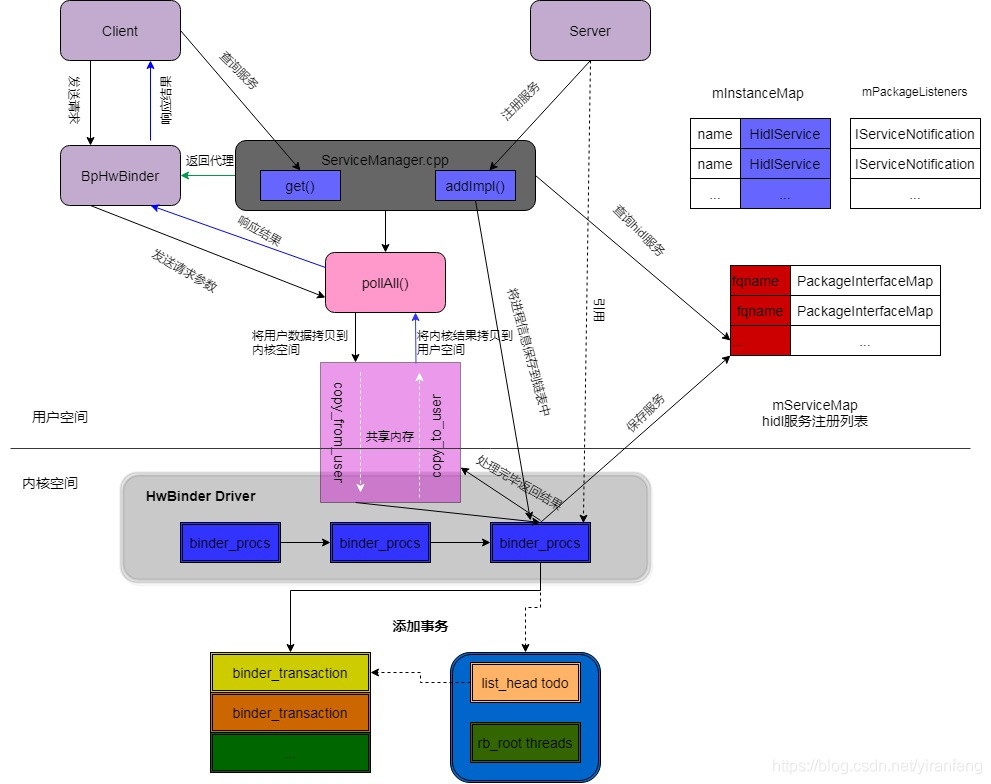
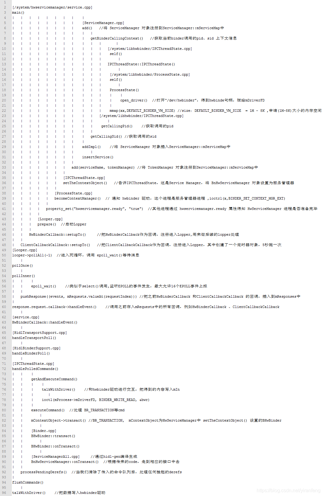

参考资料：
https://blog.csdn.net/yiranfeng/article/details/105175578
[Android Treble Architecture: Part 3 - Changes for Treble[Binder & ServiceManager]](http://strayinsights.blogspot.com/2018/07/android-treble-architecture-part-3.html)

HAL binder 是 Android O 专门用于 HAL native 进程与其 clients（可以是 native 进程，也可以是 Java Framework 进程） 之间的通信机制。

Android 8.0 之前 Android Framework 和 Android HAL 是打包成一个 system.img，Framework 和 HAL 紧耦合，需同步升级

引入 Treble 架构，将 vendor 和 system 分离，Android Framework 放在 System 空间，厂商 HAL 库放在 vendor 空间，两者之间使用 hwbinder 进行通信

将底层供应商实现从 Android 内核框架中剥离出来，允许分别独立更新平台和供应商提供的组件，新增 vendor.img，soc 及 供应商功能实现都放在 vendor 分区.

## HwBinder 通信原理

/system/tools/hidl -> 根据 HAL 接口 .hal 产生相应的 Proxy（client 端接口）以及 stub（server 端接口）

/system/libhidl -> HIDL 状态与 HAL 服务管理接口

/hardware/interfaces/ -> 各个模块 HAL 层接口，每个模块都包含了一个 Android.bp 脚本生成对应的代理（proxy）与存根对象（stub）

##### 接口定义
除 types.hal 之外，其他每个 .hal 文件均定义一个接口
不含显式 extends 生命的接口会从 android.hidl.base@1.0::IBase 隐式扩展，接口处声明了多种不应也不能在用户定义的接口中重新声明或以其他方式使用的预留方法

##### HwServiceManager 调用栈
